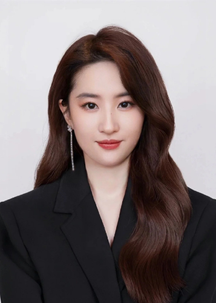
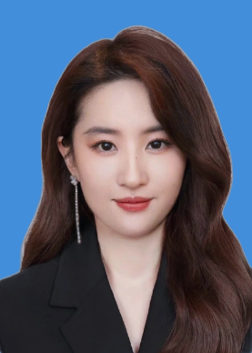
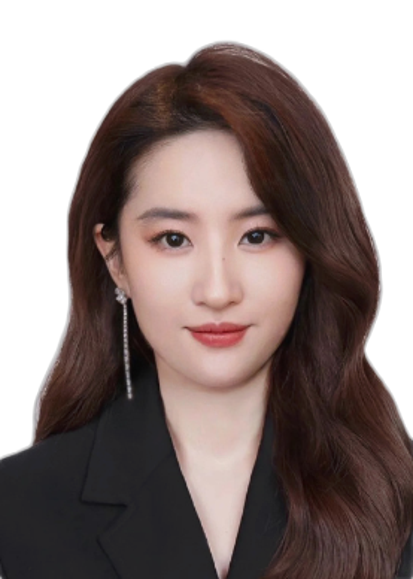
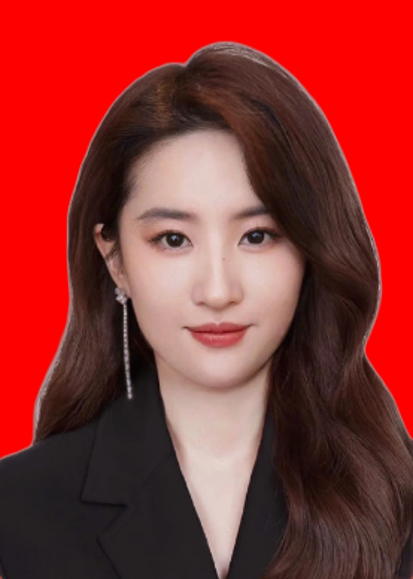

# 通过深度学习算法库，制作证件照

该项目使用了[U2Net](https://arxiv.org/pdf/2005.09007.pdf)预训练模型删除图片背景.

该项目主要用于处理图片证件照的背景，所有核心代码在main.py中。

可能使用改项目的同学，要有一定开发基础，因为我是接口版本，不是网页版本

接口参数应该每个人都不同，接口只有一个在main.py里面，有问题可以留言


### 演示  
原图：神仙姐姐真美，侵权issues留言删除，只用学习，无意冒犯    
   
<hr>

蓝色背景：  
  
白色背景：  
  
红色背景：  
  

### Install
1. 拉取代码，模型文件也在代码里面，比较大，要用git lfs
```bash
git lfs install
git clone https://github.com/2277419213/certificate_Photo.git
cd certificate_Photo
```

2. 直接有python环境的服务器或者本地跑，安装依赖
```bash
pip install -r requirements.txt
```


3. 开启服务
```bash
uvicorn main:app --host 0.0.0.0 --port 8000
```


4. 直接使用容器
```bash
cd webapp
uvicorn app:app --host 0.0.0.0 --port 8000
```

### 参考
U2Net: [https://github.com/xuebinqin/U-2-Net](https://github.com/xuebinqin/U-2-Net)
bg-remove-augment: [https://github.com/renatoviolin/bg-remove-augment](https://github.com/renatoviolin/bg-remove-augment)

### 联系方式
请作者喝咖啡

联系作者


### 引用
    @InProceedings{Qin_2020_PR,
        title = {U2-Net: Going Deeper with Nested U-Structure for Salient Object Detection},
        author = {Qin, Xuebin and Zhang, Zichen and Huang, Chenyang and Dehghan, Masood and Zaiane, Osmar and Jagersand, Martin},
        journal = {Pattern Recognition},
        volume = {106},
        pages = {107404},
        year = {2020}
}